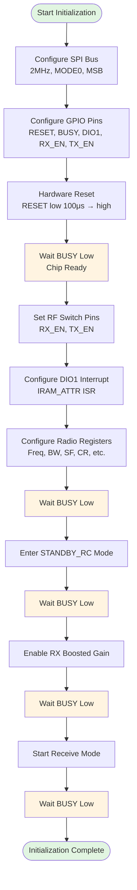
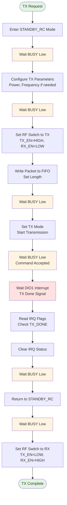
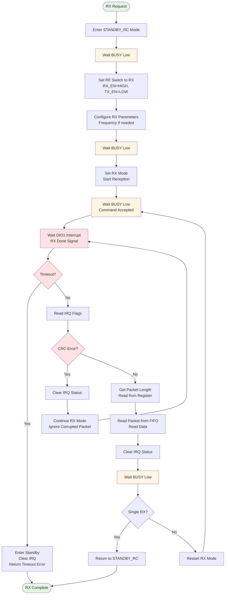
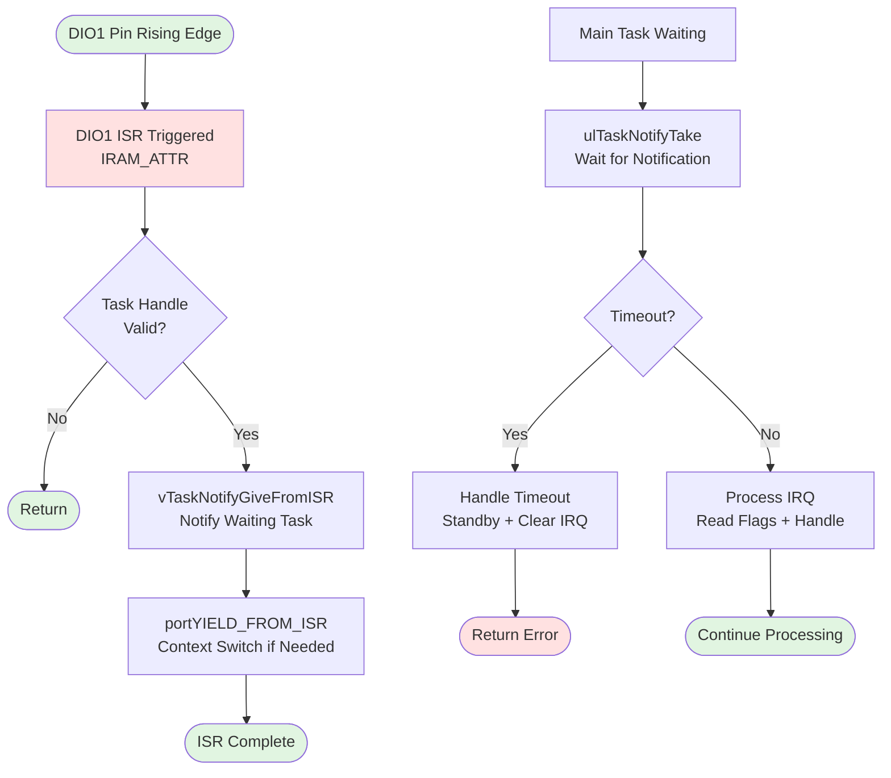
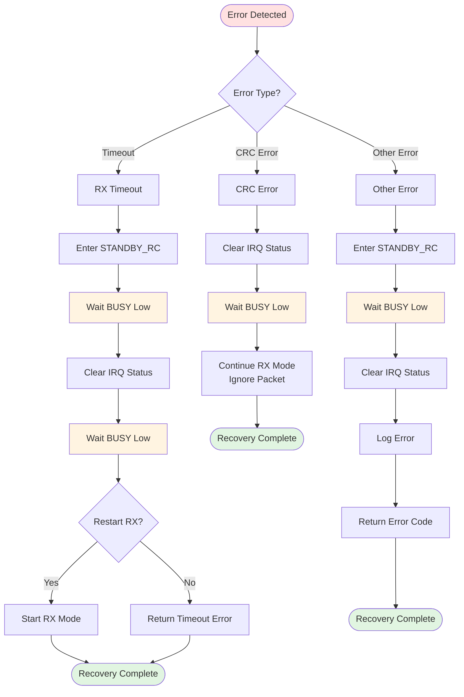
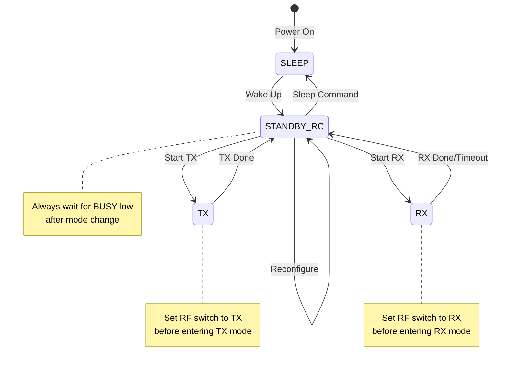

# SX1262 LoRa Module Flow Documentation

This document analyzes the SX1262 operational flow patterns extracted from the `LoRa-Test` reference implementation. It documents initialization, TX/RX procedures, BUSY pin handling, DIO1 interrupt management, and error recovery sequences.

## Reference Implementation

The flow patterns are derived from `LoRa-Test/src/main.cpp`, which uses the RadioLib library. This document extracts the underlying SX1262 command sequences and timing constraints that must be replicated in a minimal ESP-IDF implementation.

## Pin Configuration

From the reference implementation (ESP32_BOARD):
- **NSS (CS)**: GPIO 5
- **SCLK**: GPIO 18
- **MOSI**: GPIO 23
- **MISO**: GPIO 19
- **RESET**: GPIO 27
- **BUSY**: GPIO 26
- **DIO1**: GPIO 32
- **RX_EN**: GPIO 25
- **TX_EN**: GPIO 33

## Default LoRa Configuration

- **Frequency**: 869.525 MHz (869525000 Hz)
- **Bandwidth**: 125 kHz (index 7)
- **Spreading Factor**: SF9 (index 4, actual SF = 5+4 = 9)
- **Coding Rate**: 4/7 (index 2, actual CR = 5+2 = 7)
- **Sync Word**: 0xE3 (custom)
- **TX Power**: 9 dBm
- **Preamble Length**: 8 symbols (index 2, actual = 6+2 = 8)
- **TCXO Voltage**: 1.7V
- **LDO Mode**: false (uses LDO + DC-DC)

## 1. Initialization Flow

### Sequence Overview

The initialization follows this strict sequence:

1. **SPI Bus Configuration**
   - SPI frequency: 2 MHz (for 10cm wires)
   - Mode: MODE0 (CPOL=0, CPHA=0)
   - Bit order: MSB first
   - Pins: SCLK, MISO, MOSI, CS

2. **GPIO Configuration**
   - RESET: Output, initially high
   - BUSY: Input
   - DIO1: Input with interrupt
   - RX_EN, TX_EN: Output (RF switch control)

3. **Hardware Reset**
   - Pull RESET low for 100μs minimum
   - Release RESET (high)
   - Wait for BUSY to go low (chip ready)

4. **RF Switch Pin Assignment**
   - Configure RX_EN and TX_EN pins
   - RadioLib uses these to control RF switch automatically

5. **DIO1 Interrupt Setup**
   - Attach interrupt handler to DIO1 pin
   - Handler uses FreeRTOS task notification: `vTaskNotifyGiveFromISR()`
   - ISR must be in IRAM (IRAM_ATTR on ESP32)

6. **Radio Configuration (beginDefault)**
   - Set frequency
   - Set bandwidth
   - Set spreading factor
   - Set coding rate
   - Set sync word
   - Set TX power
   - Set preamble length
   - Configure TCXO voltage
   - Set LDO/DC-DC mode
   - Enter STANDBY_RC mode

7. **RX Boosted Gain Mode**
   - Enable boosted gain mode for better RX sensitivity
   - Must be set after initial configuration

8. **Start Receive Mode**
   - Enter RX mode for continuous listening

### Initialization Flowchart



### Timing Notes

- **RESET pulse**: Minimum 100μs, typically 1ms for safety
- **BUSY wait**: Must wait for BUSY low before every SPI transaction
- **BUSY timeout**: Should timeout after ~100ms if chip doesn't respond
- **SPI transaction**: After BUSY goes low, SPI can proceed immediately

## 2. BUSY Pin Handling

### Critical Timing Constraint

The BUSY pin is **critical** for proper operation. The SX1262 sets BUSY high when it cannot accept SPI commands and low when ready.

### BUSY Wait Pattern

**Before EVERY SPI transaction:**
1. Read BUSY pin state
2. If HIGH: Wait (poll or use interrupt)
3. If LOW: Proceed with SPI transaction
4. Timeout after ~100ms if BUSY never goes low

### BUSY Pin States

- **HIGH**: Chip is busy processing a command or in a state transition
- **LOW**: Chip is ready for SPI communication

### Implementation Pattern

```c
// Pseudo-code pattern from RadioLib
int wait_busy(uint32_t timeout_ms) {
    uint32_t start = get_time_ms();
    while (gpio_get_level(BUSY_PIN) == 1) {
        if (get_time_ms() - start > timeout_ms) {
            return -1; // Timeout
        }
        vTaskDelay(1); // Small delay
    }
    return 0; // Ready
}

// Usage before SPI transaction
wait_busy(100);
spi_transaction(...);
```

### Timing Notes

- **Polling frequency**: Check every 1ms (not too aggressive)
- **Timeout**: 100ms is reasonable for most operations
- **Critical sections**: BUSY must be checked atomically before SPI transactions

## 3. TX (Transmit) Flow

### Sequence Overview

1. **Enter Standby Mode**
   - Must be in STANDBY before switching to TX
   - Wait for BUSY low

2. **Configure TX Parameters** (if changed)
   - TX power
   - Frequency (if changed)

3. **Set RF Switch to TX**
   - TX_EN = HIGH
   - RX_EN = LOW
   - RF switch routes antenna to TX path

4. **Write Packet to FIFO**
   - Set FIFO pointer to 0
   - Write packet data to FIFO
   - Set packet length

5. **Start TX Mode**
   - Set chip to TX mode
   - Transmission starts automatically
   - Wait for BUSY low (command accepted)

6. **Wait for TX Done**
   - DIO1 interrupt fires when TX completes
   - Use task notification to wait: `ulTaskNotifyTake()`
   - Timeout based on Time-On-Air (TOA) calculation

7. **Read IRQ Flags**
   - Read IRQ status register
   - Check for TX_DONE flag

8. **Clear IRQ Status**
   - Clear all IRQ flags
   - Wait for BUSY low

9. **Return to Standby**
   - Set chip to STANDBY_RC mode
   - Wait for BUSY low

10. **Set RF Switch to RX**
    - TX_EN = LOW
    - RX_EN = HIGH
    - RF switch routes antenna to RX path

### TX Flowchart



### TX Timing Notes

- **Standby before TX**: Always enter STANDBY before switching to TX mode
- **TX timeout**: Calculate Time-On-Air (TOA) based on packet length, SF, BW, CR
- **DIO1 wait**: Use `ulTaskNotifyTake()` with TOA + 200ms margin
- **RF switch timing**: Set RF switch before starting TX, reset after returning to standby

### Time-On-Air Calculation

Reference implementation uses RadioLib's `getTimeOnAir()` function. For manual calculation:

```
TOA = T_preamble + T_payload

T_preamble = (n_preamble + 4.25) * T_symbol
T_payload = 8 + max(ceil((8*PL - 4*SF + 28 + 16*CRC - 20*IH) / (4*(SF-2*DE))) * (CR+4), 0)
T_symbol = (2^SF) / BW
```

Where:
- PL = Payload length in bytes
- SF = Spreading factor
- BW = Bandwidth in Hz
- CR = Coding rate (1=4/5, 2=4/6, 3=4/7, 4=4/8)
- IH = Implicit header (0=explicit, 1=implicit)
- CRC = CRC enabled (0 or 1)
- DE = Low data rate optimization (0 or 1)

## 4. RX (Receive) Flow

### Sequence Overview

1. **Enter Standby Mode**
   - Must be in STANDBY before switching to RX
   - Wait for BUSY low

2. **Set RF Switch to RX**
   - RX_EN = HIGH
   - TX_EN = LOW
   - RF switch routes antenna to RX path

3. **Configure RX Parameters** (if changed)
   - Frequency (if changed)
   - RX timeout (optional, can be infinite)

4. **Start RX Mode**
   - Set chip to RX mode
   - Reception starts automatically
   - Wait for BUSY low (command accepted)

5. **Wait for RX Done**
   - DIO1 interrupt fires when packet received
   - Use task notification to wait: `ulTaskNotifyTake()`
   - Timeout based on expected packet TOA + margin

6. **Read IRQ Flags**
   - Read IRQ status register
   - Check for:
     - **RX_DONE**: Packet received successfully
     - **CRC_ERR**: CRC error (packet corrupted)
     - **HEADER_ERR**: Header error
     - **HEADER_VALID**: Header is valid

7. **Check for Errors**
   - If CRC_ERR or (HEADER_ERR and not HEADER_VALID): Packet corrupted
   - Clear IRQ and continue RX (or return error)

8. **Get Packet Length**
   - Read packet length from register
   - Account for FIFO offset if used

9. **Read Packet from FIFO**
   - Read packet data from FIFO
   - Read from offset to length

10. **Clear IRQ Status**
    - Clear all IRQ flags
    - Wait for BUSY low

11. **Return to Standby** (if single RX) **or Restart RX** (if continuous)
    - Single RX: Return to STANDBY_RC
    - Continuous: Restart RX mode

### RX Flowchart



### RX Timing Notes

- **Standby before RX**: Always enter STANDBY before switching to RX mode
- **RX timeout**: For `receiveEx()`, timeout = TOA(packet) + 200ms + extra timeout
- **DIO1 wait**: Use `ulTaskNotifyTake()` with calculated timeout
- **CRC error handling**: Clear IRQ and continue RX (don't return error, just ignore packet)
- **Continuous RX**: After reading packet, restart RX mode immediately

### Reference Implementation Patterns

From `WaitForPacket()`:
```cpp
int16_t WaitForPacket(uint8_t* buff, size_t* size, RadioLibTime_t timeout = 0) {
    clearEvents();  // Clear task notifications
    int16_t state = startSingleRx();  // Start RX
    if (ulTaskNotifyTake(pdTRUE, waitTicks) == 0) {  // Wait for DIO1
        state = standby();  // Timeout: return to standby
        state = clearIrqStatus();  // Clear IRQ
        return RADIOLIB_ERR_RX_TIMEOUT;
    }
    state = ReadPacket(buff, RADIOLIB_SX126X_MAX_PACKET_LENGTH, size);
    return state;
}
```

From `ReadPacket()`:
```cpp
int16_t ReadPacket(uint8_t* data, size_t len, size_t* size = nullptr) {
    uint16_t irq = getIrqFlags();  // Read IRQ flags
    int16_t state = clearIrqStatus();  // Clear IRQ
    
    // Check for CRC error
    if ((irq & RADIOLIB_SX126X_IRQ_CRC_ERR) ||
        ((irq & RADIOLIB_SX126X_IRQ_HEADER_ERR) && !(irq & RADIOLIB_SX126X_IRQ_HEADER_VALID)))
        crcState = RADIOLIB_ERR_CRC_MISMATCH;
    
    size_t length = getPacketLength(true, &offset);  // Get length
    state = readBuffer(data, length, offset);  // Read FIFO
    return state;
}
```

## 5. DIO1 Interrupt Handling

### Interrupt Configuration

DIO1 is configured to fire on:
- **TX_DONE**: Transmission completed
- **RX_DONE**: Packet received
- **RX_TIMEOUT**: RX timeout occurred
- **CRC_ERR**: CRC error detected

### ISR Implementation Pattern

From reference implementation:
```cpp
void IRAM_ATTR IrqDio1(void) { 
    BaseType_t xHigherPriorityTaskWoken = pdFALSE;
    if (hIsrTask != NULL) 
        vTaskNotifyGiveFromISR(hIsrTask, &xHigherPriorityTaskWoken);
    portYIELD_FROM_ISR(xHigherPriorityTaskWoken); 
}
```

### Task Notification Pattern

The main task waits for DIO1 interrupt:
```cpp
// Clear previous notifications
xTaskNotifyStateClear(NULL);
ulTaskNotifyValueClear(NULL, 0xFFFFFFFF);

// Start RX/TX
startReceive();

// Wait for interrupt (with timeout)
if (ulTaskNotifyTake(pdTRUE, pdMS_TO_TICKS(timeout)) == 0) {
    // Timeout occurred
    standby();
    clearIrqStatus();
    return RADIOLIB_ERR_RX_TIMEOUT;
}
// Interrupt occurred, process packet
```

### DIO1 Interrupt Flowchart



### Timing Notes

- **ISR latency**: Keep ISR minimal (just notification, no processing)
- **Task notification**: Use `ulTaskNotifyTake()` with timeout
- **Clear notifications**: Clear task notifications before starting RX/TX
- **IRAM requirement**: ISR must be in IRAM (IRAM_ATTR) on ESP32

## 6. Error and Timeout Recovery

### Timeout Recovery Flow

When RX timeout occurs:

1. **Enter Standby Mode**
   - Stop current operation
   - Wait for BUSY low

2. **Clear IRQ Status**
   - Clear all pending IRQ flags
   - Wait for BUSY low

3. **Restart RX Mode** (if continuous RX desired)
   - Set RX mode again
   - Wait for BUSY low
   - Continue listening

### CRC Error Recovery

When CRC error detected:

1. **Read IRQ Flags**
   - Detect CRC_ERR or HEADER_ERR

2. **Clear IRQ Status**
   - Clear all IRQ flags
   - Wait for BUSY low

3. **Continue RX** (don't return error)
   - Restart RX mode immediately
   - Ignore corrupted packet
   - Continue listening

### Error Recovery Flowchart



### Reference Implementation Patterns

From `receiveEx()`:
```cpp
int16_t receiveEx(uint8_t* data, size_t len, RadioLibTime_t exTimeout = 0, size_t* size = nullptr) {
    int16_t state = standby();  // Enter standby first
    RadioLibTime_t timeout = MillisTOA(getTimeOnAir(len)) + 200ul + exTimeout;
    clearEvents();  // Clear task notifications
    state = startSingleRx();  // Start RX
    if (ulTaskNotifyTake(pdTRUE, pdMS_TO_TICKS(timeout)) == 0) { 
        // Timeout recovery
        state = standby();  // Return to standby
        state = clearIrqStatus();  // Clear IRQ
        return RADIOLIB_ERR_RX_TIMEOUT;
    }
    return ReadPacket(data, len, size);  // Read packet
}
```

## 7. Mode Transitions

### Mode State Machine

The SX1262 operates in these modes:

1. **SLEEP**: Lowest power, SPI disabled
2. **STANDBY_RC**: Ready state, RC oscillator running
3. **STANDBY_XOSC**: Ready state, crystal oscillator running
4. **TX**: Transmitting
5. **RX**: Receiving

### Transition Rules

- **Always enter STANDBY before TX/RX**: Never transition directly between TX and RX
- **Wait for BUSY low**: After every mode change command, wait for BUSY low
- **RF switch timing**: Set RF switch pins before entering TX/RX mode

### Mode Transition Flowchart



### Timing Notes

- **Mode transition time**: Typically 1-5ms, wait for BUSY low to confirm
- **STANDBY requirement**: Always go through STANDBY when switching between TX and RX
- **RF switch**: Must be set before mode change, reset after returning to STANDBY

## 8. Critical Timing Constraints Summary

### BUSY Pin
- **Check before every SPI transaction**: Wait for BUSY low
- **Timeout**: 100ms maximum wait time
- **Polling**: Check every 1ms (not too aggressive)

### DIO1 Interrupt
- **ISR latency**: Keep minimal (notification only)
- **Task wait timeout**: TOA + 200ms margin for RX, TOA for TX
- **Clear notifications**: Clear before starting new RX/TX

### Mode Transitions
- **STANDBY before TX/RX**: Always required
- **Wait for BUSY**: After every mode change command
- **RF switch timing**: Set before mode, reset after STANDBY

### SPI Transactions
- **Frequency**: 2MHz (for 10cm wires, can go higher with shorter wires)
- **Mode**: MODE0 (CPOL=0, CPHA=0)
- **Bit order**: MSB first
- **BUSY wait**: Before every transaction

## 9. Implementation Checklist

When implementing the ESP-IDF driver, ensure:

- [ ] BUSY pin checked before every SPI transaction
- [ ] DIO1 ISR uses IRAM_ATTR and task notifications
- [ ] STANDBY mode entered before TX/RX transitions
- [ ] RF switch pins set before mode changes
- [ ] IRQ flags read and cleared after operations
- [ ] Timeout handling with proper recovery
- [ ] CRC error handling (clear IRQ, continue RX)
- [ ] Task notifications cleared before starting RX/TX
- [ ] All mode transitions wait for BUSY low
- [ ] RX boosted gain mode enabled after initialization

## 10. Reference Code Patterns

### Key Functions from RadioLib (to replicate)

1. **waitForBusy()**: Poll BUSY pin until low
2. **SPI transaction**: With BUSY wait before
3. **standby()**: Enter STANDBY_RC mode
4. **transmit()**: Full TX flow
5. **startReceive()**: Start RX mode
6. **readBuffer()**: Read FIFO data
7. **getIrqFlags()**: Read IRQ status
8. **clearIrqStatus()**: Clear IRQ flags
9. **getPacketLength()**: Get received packet length

### Sequence Patterns

**TX Pattern:**
```
standby() → wait BUSY → set RF switch TX → write FIFO → start TX → wait BUSY → wait DIO1 → read IRQ → clear IRQ → standby() → set RF switch RX
```

**RX Pattern:**
```
standby() → wait BUSY → set RF switch RX → start RX → wait BUSY → wait DIO1 → read IRQ → check CRC → get length → read FIFO → clear IRQ → (restart RX or standby)
```

**Error Recovery Pattern:**
```
standby() → wait BUSY → clear IRQ → wait BUSY → (restart RX or return error)
```

---

**Document Version**: 1.0  
**Last Updated**: Based on LoRa-Test/src/main.cpp analysis  
**Reference**: Waveshare Core1262-868M (SX1262) with RadioLib library

