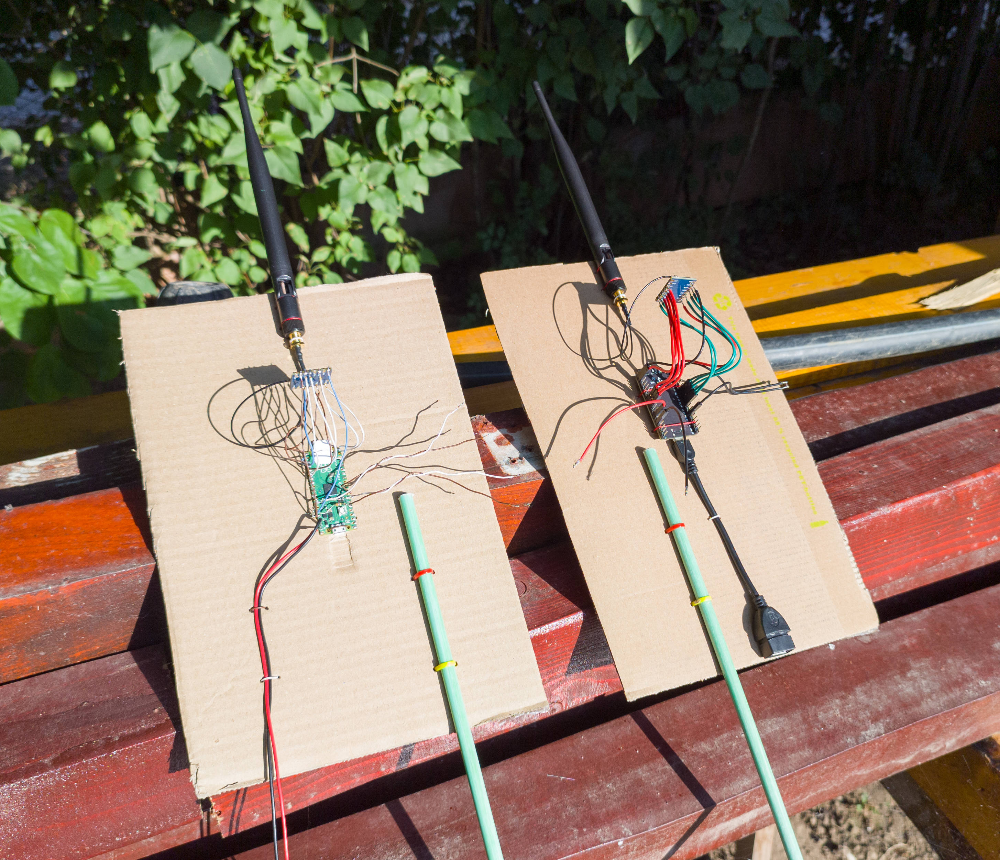

# ESP32 LoRa Test Project

This is a test program for the SX1262 LoRa chip, developed in VSCode with PlatformIO. It allows two LoRa modules to communicate with each other using ESP32 or Raspberry Pi Pico microcontrollers, together with the [RadioLib](https://github.com/jgromes/RadioLib) library. The project includes a web interface from where you can configure the modules, calculate link parameters and make the actual test, consisting of sending a data packet from one module to the other and back. If communication succeeds, the results are displayed. Additionally, you can use your phone's GPS to measure the distance between the modules.

## Hardware Setup (Europe Region)
This is what I used...
* 2 x [Waveshare Core1262-HF](https://www.waveshare.com/wiki/Core1262-868M)
* 2 x [868MHz 5 dBi LoRa Antenna (IPEX-Cable)](https://www.aliexpress.com/item/1005006833587735.html)
* 2 x [ESP32-DevKitC-VE](https://www.aliexpress.com/item/1005004441541467.html)
* 2 x [Redmi Power Bank 10000 mAh](https://www.mi.com/ae-en/product/10000mah-redmi-power-bank/)
* USB cables for programming

For a quick test prototype, you just need to wire the LoRa modules to their controlling devices (ESP32 or Pico), and fix them together on a piece of cardboard or something, like I did, so you can carry them on the test field... You can find the pin connection diagram at the beginning of the source code.

## How it Works
The software in `/src/main.cpp` is for both modules: TX (the "client" module), the mobile unit you carry in the field to initiate tests, and RX (the "server" module), the fixed unit you leave at the base, which responds to client commands. The role of the module is selected at build time using the `#define TX_MODULE` directive at the beginning of the source code. You can leave it defined to build the firmware for the TX (client) module, or comment it out to build the firmware for the RX (server) module. 

For the TX (client) module, you also need to build and upload the filesystem image, which contains the web page for the ESP32 http server. This page is the control panel that you can access from your phone to interact with the module. 

After the firmware for both modules is built and uploaded, the TX module with ESP32 will create a WiFi Access Point, which you will connect to from your phone, and then access the control page using its IP address 192.168.4.1 from your browser.

The problem here is that ESP32 server uses simple http protocol (not the secure https) so the browser won't let you use the GPS to measure the distance when you make tests. I overcome this by using the Brave browser and then entered `brave://flags` in the address bar. On the page that opens, I went to the section "Insecure origins treated as secure", I added the ESP32 IP address and enabled the option.

Note: On my phone, I also had to disable mobile data to be able to access the ESP32 local page.

## The Web Interface
You can view a demo of the [LoRa Control Panel](https://marus-gradinaru.42web.io/ESP32/LoRa-Test/Demo/index.html) on my website, which will help illustrate the web interface described below. The web interface is optimized for vertical viewing on a mobile phone, so if you open it on a desktop it may look a bit odd.
Naturally, it is not fully functional in this form, since it is not connected to an ESP32.

### ➤ RF Link Parameters
Here you can set the antenna gain and cable loses for both modules involved in this test. TX refers to the client module and RX to the server module. In the "_Real Setup Noise_" field you can enter how much noise generate your real hardware setup (for example, the additional noise from the ESP32), compared to the noise floor of the SX1262 chip measured under ideal conditions by Semtech. Adjust this until the calculated Sensitivity below equals the idle Band RSSI measured value. 

### ➤ LoRa Configuration
Here you can configure the LoRa module parameters, such as: frequency, TX power, bandwidth, spreading factor, coding rate, and preamble length. After making changes, press the "_Apply_" button to update both modules (the local and the remote one). The modules will attempt to communicate using the new settings, and if the configuration causes them to lose connection, they will automatically fall back to the last working setup.

The "_Set Local_" button is used in case your client module lose power and restart itself. When it comes back online, simply press this button to update its configuration.
Otherwise, the module will use the default settings, which may differ from the other module’s configuration, preventing communication between them.

### ➤ LoRa Link Summary
This section displays the results of calculations based on the LoRa and RF link configuration parameters. You can view the estimated Link Budget and the expected working range, as calculated using Semtech’s formula. In practice, the actual range will likely be shorter, since Semtech's calculations seem to assume ideal conditions to demonstrate the full potential of their chips.

### ➤ LoRa Range Test
From this section you can initiate a packet transmission to verify communication with the other module. You can choose the "_Payload Size_" (255 bytes max) and whether you want the results to be logged or not. 

If you enable the "_Band RSSI Monitor_" the Band RSSI (noise floor) will be displayed in real time here. The distance between the TX module (client) and the base station, RX server module, measured by the GPS, is also displayed in real time.

When you are ready, press the "_Start Test_" button to begin the test. If it succeeds, the measured link parameters (RSSI, SNR and Frequency Error) will be displayed in the table below, for both modules. The "_Remote RX_" column shows the values measured by the remote module when your client transmits. The "_Local RX_" column shows the same values measured by your client when the remote module replies. Based on these measurements, the link margin, path loss, and noise floor are also calculated.

### ➤ LoRa Test Results
The test results are logged in this panel. The most recent one is added at the top. You can save the log to a file pressing the "_Download Log_" button, then clear the log results.

### ➤ LoRa Bulk Test
This test is designed to measure the bulk data transfer rate of a LoRa connection. When you select the "_Payload Size_" to transmit, the corresponding packet configuration is calculated and displayed below. The "_Tx Delay_" parameter adjusts the pause inserted before each packet transmission, allowing the receiver to keep up with the packet flow. Through testing, I found that a 4 ms delay provides the best trade-off between reliability and speed, resulting in a maximum throughput of about **5.2 KB/s** with the fastest LoRa settings. Further details about the LoRa Bulk Protocol can be found in the "_Info_" folder.

When the test is complete, protocol debug timing information is displayed below the Data Rate panel.
With the exception of the "_Reply Timing_" section, in all other sections the top value must be greater than the bottom value for the protocol to work correctly. In the "_Reply Timing_" section, however, the logic is reversed.

### ➤ GPS Monitoring
You can also use your phone's GPS to measure the distance between the two modules during tests. On the left side is your current location updated in real time. First, go to the location where will you leave the RX module (server), and when the GPS shows the highest precision, press the "_Set_" button on the right side, to store the base station location, which will be used later to calculate the distance when you move. 

### ➤ Other Settings
For now, you can activete only the "_Band RSSI Monitor_" form here. The Band RSSI is displayed in the Test panel.